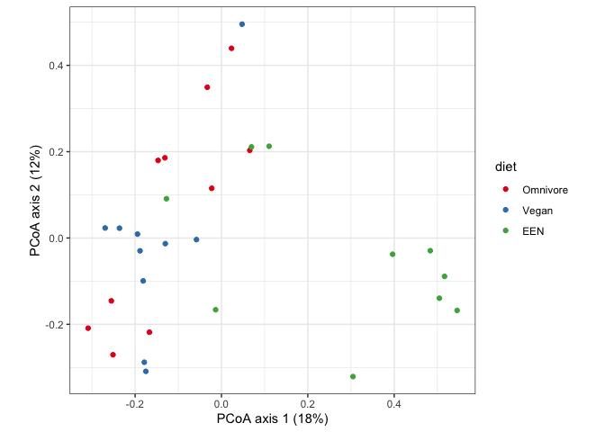

<!-- README.md is generated from README.Rmd. Please edit that file -->

# adonisplus

<!-- badges: start -->

[](https://github.com/PennChopMicrobiomeProgram/adonisplus/actions)
[](https://codecov.io/gh/PennChopMicrobiomeProgram/adonisplus)
<!-- badges: end -->

The `adonisplus` package provides some utilities for permutational
multivariate analysis of variance, also known as adonis or PERMANOVA.

## Installation

You can install the development version from
[GitHub](https://github.com/) with:

``` r
# install.packages("devtools")
devtools::install_github("PennChopMicrobiomeProgram/adonisplus")
```

## Using adonisplus

``` r
library(tidyverse)
```

To show an example, we’ll use a built-in data set from the [FARMM
study](https://pubmed.ncbi.nlm.nih.gov/33440171/) by Tanes et
al. Participants consumed one of three diets for the duration of the
study: omnivore, vegan, or exclusive enteral nutrition (EEN). On days
5-8, participants were given a combination of three antibiotics to clear
out bacteria in the gut. Additionally, participants underwent a gut
purge on day 8. The fecal microbiome and metabolome were sampled
throughout the study. Here, we will work with the microbiome data, which
was generated by shotgun metagenomic sequencing.

Our data objects are a data frame of sample info, `farmm_samples`, and a
matrix of Bray-Curtis distances between samples, `farmm_bc`. The
Bray-Curtis distances are derived from differences in the abundance of
the taxa that comprise the fecal microbiome. We have one distance for
each pair of samples. Let’s look at the data frame of samples.

``` r
farmm_samples
```

    ## # A tibble: 414 × 11
    ##    sample_id     subject_id study_day diet     antibiotics height weight   age
    ##    <chr>              <dbl>     <int> <fct>    <fct>        <dbl>  <dbl> <dbl>
    ##  1 farmm.9005.00       9005         0 Omnivore pre            180     70    24
    ##  2 farmm.9005.02       9005         2 Omnivore pre            180     70    24
    ##  3 farmm.9005.03       9005         3 Omnivore pre            180     70    24
    ##  4 farmm.9005.04       9005         4 Omnivore pre            180     70    24
    ##  5 farmm.9005.06       9005         6 Omnivore current        180     70    24
    ##  6 farmm.9005.07       9005         7 Omnivore current        180     70    24
    ##  7 farmm.9005.08       9005         8 Omnivore current        180     70    24
    ##  8 farmm.9005.09       9005         9 Omnivore post           180     70    24
    ##  9 farmm.9005.10       9005        10 Omnivore post           180     70    24
    ## 10 farmm.9005.11       9005        11 Omnivore post           180     70    24
    ## # ℹ 404 more rows
    ## # ℹ 3 more variables: bacterial_16S_copies <dbl>, num_reads <dbl>,
    ## #   host_frac <dbl>

The first column, `sample_id` provides a unique ID for each sample,
which is also used to label the samples in the distance matrix.

Before we get into any complicated stuff, let’s run a simple example
without any repeated measurements. Let’s ask if the diet groups were
different, using the last time point obtained for each participant.
We’ll make a new data frame, `farmm_final`, containing just the samples
we need.

``` r
farmm_final <- farmm_samples %>%
  group_by(subject_id) %>%
  filter(study_day == max(study_day)) %>%
  ungroup()
```

First, we’ll run a principal coordinates analysis (PCoA) of the final
time point using `pcoaplus()`. To use this function, we pipe in the data
frame of samples as the first argument. The second argument is the
distance matrix, `farmm_bc`. We need a third argument to specify which
column of the data frame matches the IDs in the distance matrix. The
functions in this package will automatically re-arrange the distance
matrix to match the data frame, so you can use the same distance matrix
over and over as you filter and re-arrange the samples. Here, we specify
this column as `sample_id`.

``` r
farmm_final %>%
  pcoaplus(distmat = farmm_bc, sample_id_var = sample_id)
```

    ## # A tibble: 30 × 13
    ##    sample_id  Axis.1 Axis.2 subject_id study_day diet  antibiotics height weight
    ##    <chr>       <dbl>  <dbl>      <dbl>     <int> <fct> <fct>        <dbl>  <dbl>
    ##  1 farmm.90… -0.251  -0.271       9005        15 Omni… post          180    70  
    ##  2 farmm.90…  0.0656  0.203       9006        15 Omni… post          176    87.3
    ##  3 farmm.90… -0.255  -0.146       9010        15 Omni… post          171.   63.4
    ##  4 farmm.90… -0.167  -0.218       9015        15 Omni… post          173    61.3
    ##  5 farmm.90… -0.309  -0.209       9019        15 Omni… post          174.   66.3
    ##  6 farmm.90… -0.0329  0.349       9030        15 Omni… post          180.   90  
    ##  7 farmm.90… -0.0226  0.115       9033        15 Omni… post          170.   78.6
    ##  8 farmm.90…  0.0233  0.439       9036        15 Omni… post          178    75.8
    ##  9 farmm.90… -0.131   0.186       9037        15 Omni… post          176    71.3
    ## 10 farmm.90… -0.147   0.180       9040        15 Omni… post          173    71  
    ## # ℹ 20 more rows
    ## # ℹ 4 more variables: age <dbl>, bacterial_16S_copies <dbl>, num_reads <dbl>,
    ## #   host_frac <dbl>

We see that `pcoaplus()` has returned a new data frame, with two new
columns, `Axis.1` and `Axis.2`. We could use this to go straight into
`ggplot()`, but our data frame has a custom plot method that adds in
some nice details, like the percent variation for each axis. When
calling `plot()`, we override the default mapping to color the samples
by diet. We also add a few elements to the `ggplot` object, to set the
color scale and change the theme.

``` r
farmm_final %>%
  pcoaplus(distmat = farmm_bc, sample_id_var = sample_id) %>%
  plot(color = diet) +
  scale_color_brewer(palette = "Set1") +
  theme_bw()
```

<!-- -->

It looks like the microbiome of the EEN diet group is different from
that in the omnivore and vegan groups. Let’s test for differences
between the diet groups using `adonisplus()`. As with `pcoaplus()`, we
pipe in the data frame of study info as the first argument, then provide
the distance matrix as the second argument. Our third argument is a
formula to specify the statistical model. The formula must have
`distmat` on the left-hand side, which allows us to re-use the same
formula with different distance matrices. As before, we add an
additional argument to let the function know which column of the data
frame corresponds to the IDs in the distance matrix.

``` r
farmm_final %>%
  adonisplus(
    distmat = farmm_bc, formula = distmat ~ diet,
    sample_id_var = sample_id)
```

    ## # A tibble: 3 × 6
    ##   term        df sumsq r.squared statistic p.value
    ##   <chr>    <dbl> <dbl>     <dbl>     <dbl>   <dbl>
    ## 1 diet         2  1.84     0.168      2.73   0.001
    ## 2 Residual    27  9.07     0.832     NA     NA    
    ## 3 Total       29 10.9      1         NA     NA

Our result looks like the output of `adonis()` from the `vegan` package,
but it’s been tidied up into a data frame. If you have your own results
from `adonis()`, you can tidy them up yourself using the `tidy.adonis()`
function from this package.

It looks like the diet groups are different, but we don’t know which
pairs are different. My guess would be that EEN is different than
omnivores and vegans, and that omnivores aand vegans are not different
from each other. To run the pairwise comparisons, we’ll use
`adonispost()`. The arguments to this function are the same as
`adonisplus()`, but we add an additional argument, `which`, to specify
the variable on which we want to carry out pairwise comparisons.

``` r
farmm_final %>%
  adonispost(
    distmat = farmm_bc, formula = distmat ~ diet,
    sample_id_var = sample_id, which = diet)
```

    ## # A tibble: 4 × 7
    ##   comparison       term     df sumsq r.squared statistic p.value
    ##   <chr>            <chr> <dbl> <dbl>     <dbl>     <dbl>   <dbl>
    ## 1 All diet         diet      2 1.84     0.168       2.73   0.001
    ## 2 Omnivore - Vegan diet      1 0.445    0.0671      1.30   0.159
    ## 3 Omnivore - EEN   diet      1 1.15     0.159       3.39   0.001
    ## 4 Vegan - EEN      diet      1 1.16     0.165       3.56   0.001

The results are as expected. So, far we could have done all of this work
using the functions in `vegan` and `ape`, without much difficulty.
However, the `adonisplus` package really shines when we have
experimental designs with repeated measures.

Let’s move beyond a single time point, to see how the microbiome changes
over time for each diet. To get an overview, we’ll re-generate Figure 2A
from the paper.

``` r
farmm_samples %>%
  pcoaplus(distmat = farmm_bc, sample_id_var = "sample_id") %>%
  plot(color = study_day) +
  facet_grid(~ diet) +
  scale_color_viridis_c(direction = -1) +
  theme_bw()
```

<!-- -->

The paper reports that “EEN led to a significant change in the
microbiota composition within 3 days of the dietary phase relative to
the vegan and omnivore group.” The next sentence says, “The vegan and
omnivore groups were not significantly different from each other until
day 7, which marks the introduction of PEG.” Let’s check that out for
ourselves.

To investigate both claims, we’ll limit the data set to the
pre-antibiotics period, and call it `farmm_preabx`.

``` r
farmm_preabx <- farmm_samples %>%
  filter(antibiotics %in% "pre")
```

Now, we’ll run `adonisplus()` on a sample set with repeated measures. We
need to provide two additional arguments. First, we give the variable
within which the measures are repeated, `subject_id` in our case.
Secondly, we need to tell `adonisplus()` how to randomly re-assign each
variable in the formula. Here, we tell it to randomly re-assign diet
between subjects, and randomly shuffle the study days within each
subject.

``` r
farmm_preabx %>%
  adonisplus(
    distmat = farmm_bc, formula = distmat ~ diet * study_day,
    sample_id_var = sample_id, rep_meas_var = subject_id,
    shuffle = c(diet = "between", study_day = "within"))
```

    ## # A tibble: 5 × 6
    ##   term              df  sumsq r.squared statistic p.value
    ##   <chr>          <dbl>  <dbl>     <dbl>     <dbl>   <dbl>
    ## 1 diet               2  4.34     0.104       8.62   0.001
    ## 2 study_day          1  0.504    0.0121      2.00   0.001
    ## 3 diet:study_day     2  0.663    0.0159      1.32   0.001
    ## 4 Residual         144 36.2      0.868      NA     NA    
    ## 5 Total            149 41.7      1          NA     NA

If you run this function yourself, you’ll notice that it takes a lot
longer than it takes to run `adonis()`. As we randomly re-assign diets
and time points, we re-run the `adonis()` function once for each
re-assignment or permutation.[^1] The functions used by `adonisplus()`
to carry out the restricted permutations are named
`shuffle_within_groups()` and `shuffle_between_groups()`, if you want to
use them elsewhere.

Having found a difference between the diets overall, we wish to know
which diet pairs are different. As before, we use `adonispost()` and
tell it to run pairwise comparisons of diet by setting `which = diet`.

``` r
farmm_preabx %>%
  adonispost(
    distmat = farmm_bc, formula = distmat ~ diet * study_day,
    sample_id_var = sample_id, rep_meas_var = subject_id,
    shuffle = c(diet = "between", study_day = "within"),
    which = diet)
```

    ## # A tibble: 12 × 7
    ##    comparison       term              df  sumsq r.squared statistic p.value
    ##    <chr>            <chr>          <dbl>  <dbl>     <dbl>     <dbl>   <dbl>
    ##  1 All diet         diet               2 4.34     0.104       8.62    0.001
    ##  2 All diet         study_day          1 0.504    0.0121      2.00    0.001
    ##  3 All diet         diet:study_day     2 0.663    0.0159      1.32    0.001
    ##  4 Omnivore - Vegan diet               1 1.68     0.0635      6.61    0.119
    ##  5 Omnivore - Vegan study_day          1 0.0804   0.00305     0.317   0.726
    ##  6 Omnivore - Vegan diet:study_day     1 0.0358   0.00136     0.141   0.988
    ##  7 Omnivore - EEN   diet               1 1.89     0.0683      7.59    0.025
    ##  8 Omnivore - EEN   study_day          1 0.628    0.0227      2.53    0.001
    ##  9 Omnivore - EEN   diet:study_day     1 0.523    0.0189      2.10    0.001
    ## 10 Vegan - EEN      diet               1 2.99     0.109      11.8     0.001
    ## 11 Vegan - EEN      study_day          1 0.668    0.0245      2.64    0.001
    ## 12 Vegan - EEN      diet:study_day     1 0.399    0.0146      1.58    0.001

In the pairwise comparisons, we find that the microbiome of the omnivore
and vegan groups was not different during the pre-antibiotics period,
based on Bray-Curtis distance. Conversely, the microbiome of the EEN
group was different from both the omnivores and vegans.

Notice that, for all the comparisons above, we’ve been able to use the
same distance matrix, `farmm_bc`. Each time we called a function using
the distances, the distance matrix was automatically filtered and
re-arranged to match the samples in our data frame. How convenient!

[^1]: In fact, the `adonis()` function has some built-in capability to
    carry out restricted permutations, but because the built-in methods
    permute the samples and not the study groups, the between-subject
    permutations don’t work if you don’t have exactly the same number of
    samples per subject. Consequently, our data set would not work with
    the built-in permutation methods in `adonis()`.
